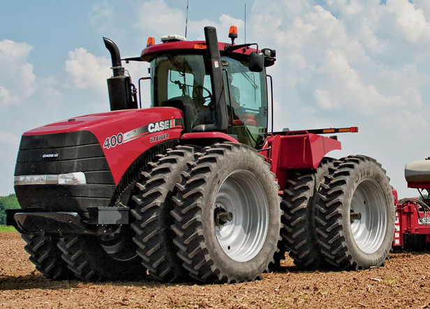

<!DOCTYPE html>
<html lang="ru">
	<head>
		<meta http-equiv="content-type" content="text/html;charset=UTF-8" />
	<head>
	<body>
		<h1>Ive Agro </h1>
		
		
- Надання оперативної інформації для агрономічного відділу та служби безпеки по фактичному обробітку ТЗ для контролю норми ТМЦ та обсягу виконаних робіт.

		

			
			- Надання щомісячної інформації по роботах вантажного транспорту, тракторів та легкового транспорту 
		
		

		
- Аналіз використання ТМЦ на польові роботи (порівняння фактичного використання із плановим)

		<h2>Надаємо та працюємо з такими видами послуг</h2>
		<ol>
			<li>Нанесення контура полів на карту та надання даних контурів для земельників для співставлення фактично оброблених площ із орендованими.</li>
			<li>Фіксування зміни площ полів відповідно до фактичного обробітку (дібрані площі, обмін, розорані площі, вихідці).</li>
			<li>Розробляємо порівняльні таблиці: площ полів, посівів, обробітку, між роками.</li>
			<li>Контроль швидкості ТЗ за критеріями, встановленими агрономічною та інженерною службами</li>
			<li>Облік роботи зернозбиральних та бурякозбиральних комбайнів</li>
			<li>Продаж сучасної техніки для сільського господарства</li>
		</ol>
		
		<h2>Формуємо також такі звіти</h2>
		<ul>
			<li>Формування паспортів полів в кінці року </li> 
			<li>Аналіз ПММ тракторів </li>
			<li>Формування щоденного звіту по роботі та руху ТЗ та надання інформації для диспетчерів, обліковців, агрономів.</li>
			<li>Аналіз ПММ вантажного транспорту та комбайнів.</li>
		</ul>
		<h2>Наші контакти:</h2>
		
tel:<a href="tel:+380968390535">+380968390535</a>

		
youtube:<a href="https://www.youtube.com/watch?v=mm5QkX5UYB4"> Наш парк техніки.</a>

		
mail:<a href="https://mail.google.com/mail/u/0/?tab=rm#inbox">nasim610890@gmail.com.</a>

		
© Агро-форум, 2015

	</body>
</html>