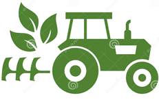

<!DOCTYPE html>
<html lang="ru">
	<head>
		<meta http-equiv="content-type" content="text/html;charset=UTF-8" />
	<head>
	<body>
		<h1>Ive Agro </h1>
		
		<h2>Нанесення контура поля на карту</h2>
		
		
Ми використовуємо американські сканери, постійно взаємодіючи з колегами з США. 
			Функція апаратів - побудова карт електропровідності, дослідження наявності органічної речовини і рівня кислотності грунту. 
			На поле в 100 га ми беремо близько 10-20 проб, тут же заносимо їх в ноутбук прямо в кабіні трактора. 
			Відбір зразків і калібрування проводимо в лабораторії. Сканери перевіряємо перед кожним виїздом, 
		адже ми впевнені, що точне землеробство починається в голові, а не відразу на полі.

		<h2>Наші контакти:</h2>
		
tel:<a href="tel:+380968390535">+380968390535</a>

		
youtube:<a href="https://www.youtube.com/watch?v=mm5QkX5UYB4"> Наша техніка.</a>

		
mail:<a href="https://mail.google.com/mail/u/0/?tab=rm#inbox">nasim610890@gmail.com.</a>

		
© Агро-форум, 2015

	</body>
</html>